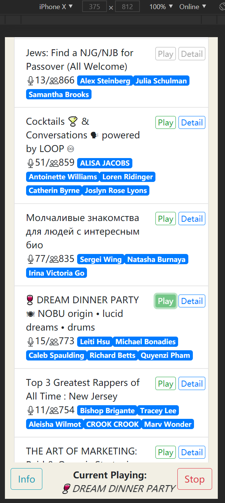
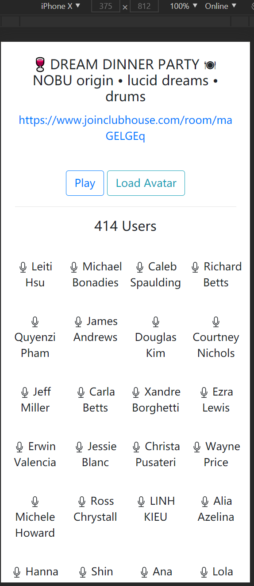

# OpenClubhouse

A third-part web application based on flask to play Clubhouse audio.

## Statement

This is a third part Clubhouse audio player open for everyone. I hope that anyone without invite code or iPhone can also hear the voice. All room accesses are acquired from personal session, and all copyrights of the voice are belongs to Clubhouse and its users.

## Preview

Index Page:

Room Detail Page:

## Run

1. This app requires a client [OpenClubhouse-Worker](https://github.com/ai-eks/OpenClubhouse-Worker) to sync channel data.
2. Install python packages by `pip install -r requirements.txt`
3. Modify configs in config.py. Especially the SECRET_KEY in production environment.
4. Modify environment variables in run.sh.
5. Execute `sh setEnv.sh` to run this code.

## Third-part software

- Python
- Flask
- flask-mongoengine
- mongoDB
- jquery
- bootstrap
- agora

## Reference

- [Agora SDK](https://docs.agora.io/en/Voice/API%20Reference/web_ng/index.html)
- https://github.com/zhuowei/hipster.house